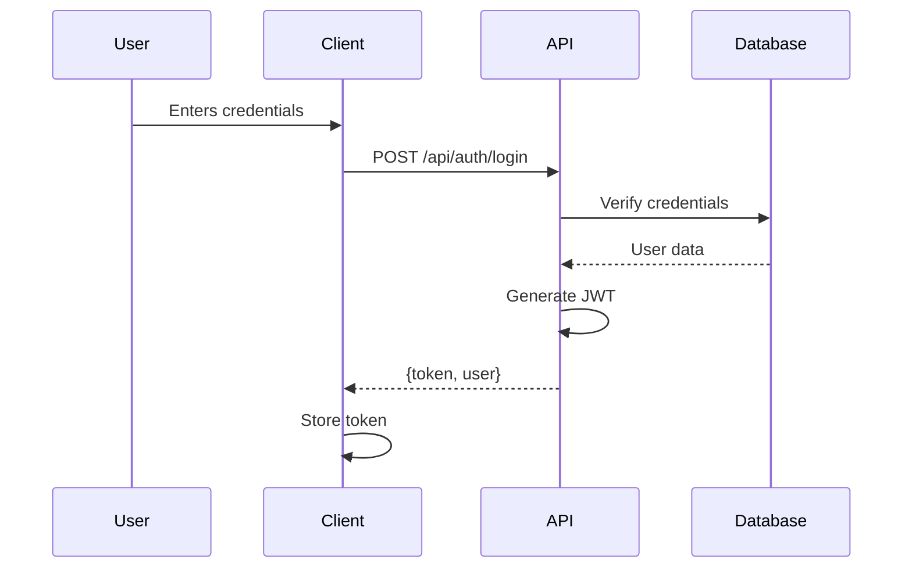
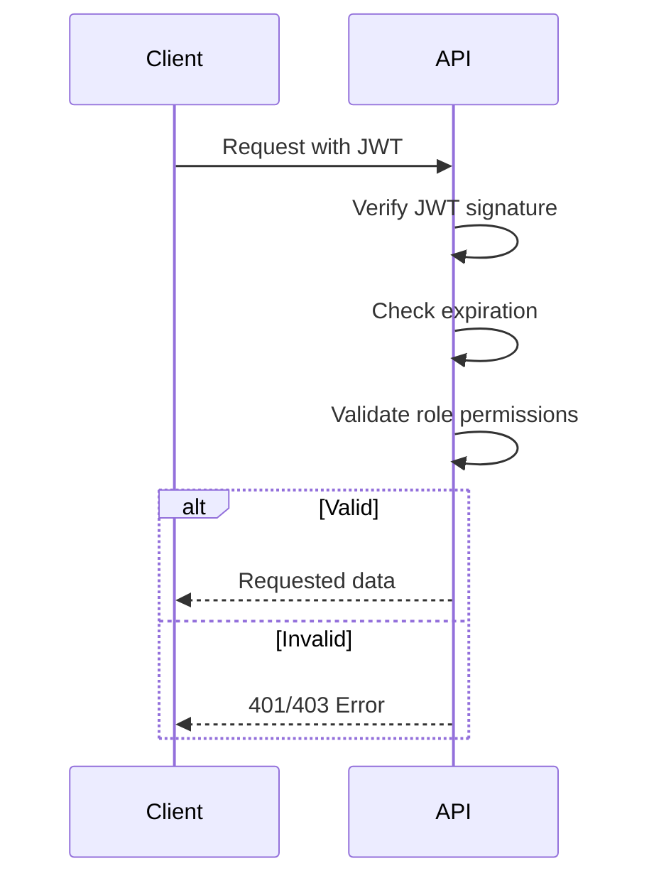

# Authentication & Authorization Flow

## 1. Login Sequence


## 2. JWT Structure
- Header: 
  ```json
  {
    "alg": "HS256",
    "typ": "JWT"
  }
  ```
- Payload:
  ```json
  {
    "sub": "user_id",
    "role_id": "role_id",
    "iat": 1516239022,
    "exp": 1516242622
  }
  ```
- Signature: HMAC SHA256

## 3. Protected Request Flow


## 4. Token Refresh Flow
- Client monitors token expiration
- When nearing expiry (5 min remaining):
  ```mermaid
  sequenceDiagram
      Client->>API: POST /api/auth/refresh
      API->>API: Validate current token
      API-->>Client: New token
  ```

## 5. Error Handling
| Scenario | Status | Response |
|----------|--------|----------|
| Invalid credentials | 401 | `{"error": "Invalid credentials"}` |
| Expired token | 401 | `{"error": "Token expired"}` |
| Missing token | 401 | `{"error": "Authentication required"}` |
| Insufficient permissions | 403 | `{"error": "Insufficient permissions"}` |
