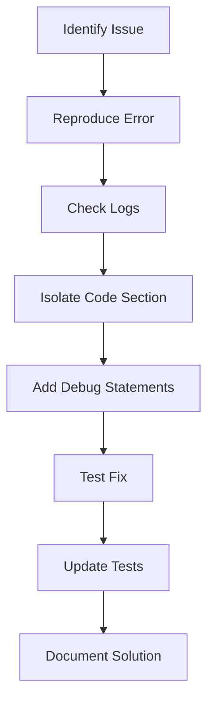
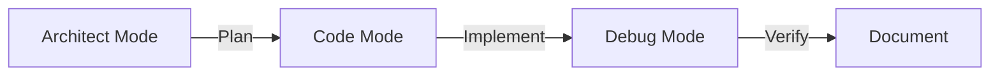

# Debugging and Code Modification Guide

## 1. Debugging Workflow Template


### Example: Debugging Role-Based Access
```php
// In CheckRole.php middleware
public function handle(Request $request, Closure $next, string $roleName): Response
{
    \Log::debug('Role check initiated', ['user' => $request->user()->id, 'required_role' => $roleName]);
    // ... rest of code
}
```

## 2. Code Modification Patterns

### Pattern 1: Middleware Modification
```diff
<<<<<<< SEARCH
:start_line:12
-------
    public function handle(Request $request, Closure $next, string $roleName): Response
    {
        $user = $request->user();
=======
    public function handle(Request $request, Closure $next, string|array $roleNames): Response
    {
        $user = $request->user();
        $roleNames = is_array($roleNames) ? $roleNames : [$roleNames];
>>>>>>> REPLACE
```

### Pattern 2: Test Case Update
```php
// In RoleBasedAccessTest.php
public function test_multiple_roles_access()
{
    // New test for multi-role support
}
```

## 3. Efficient Vibe Coding Usage

### Workflow Optimization


### Tool Cheat Sheet:
1. `read_file` - Get context before changes
2. `apply_diff` - Surgical code edits
3. `execute_command` - Run tests/linters
4. `browser_action` - Verify UI changes
5. `update_todo_list` - Track progress

## 4. Real Project Examples

### Example 1: Adding Password Reset
1. **Debug**: Check auth flow in [`app/Http/Controllers/Auth/AuthController.php`](app/Http/Controllers/Auth/AuthController.php)
2. **Modify**: Add `resetPassword` method
3. **Test**: Create new test case

### Example 2: Multi-Role Support
1. Modify [`app/Http/Middleware/CheckRole.php`](app/Http/Middleware/CheckRole.php)
2. Update [`tests/Feature/RoleBasedAccessTest.php`](tests/Feature/RoleBasedAccessTest.php)
3. Adjust [`app/Models/User.php`](app/Models/User.php) relationships

## 5. Best Practices
- Always run tests after modifications
- Use atomic commits for each change
- Document decisions in code comments
- Verify with browser_action for UI changes
- Update API documentation concurrently
